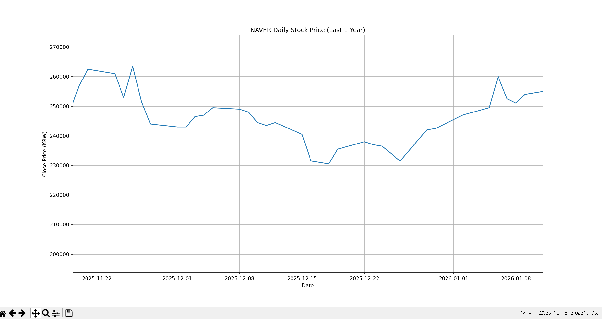
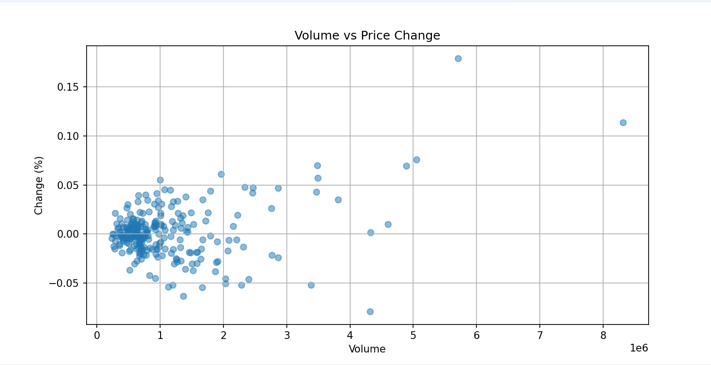
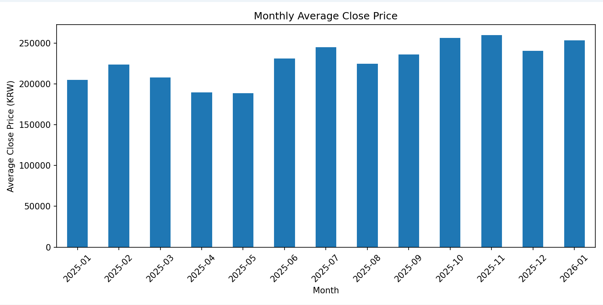
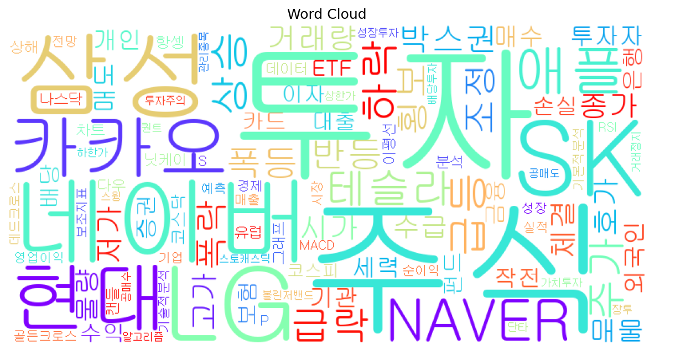

# 데이터 시각화 실습 (2026.01.17)

Python을 활용한 다양한 데이터 시각화 기법 실습 프로젝트


## 📌 프로젝트 개요

본 프로젝트는 `matplotlib`, `FinanceDataReader`, `WordCloud` 라이브러리를 활용하여  
4가지 시각화 기법을 학습하고 실습한 결과물입니다.

---

## 🛠 사용 기술

- **Python 3.x**
- **pandas** - 데이터 처리
- **matplotlib** - 그래프 시각화
- **FinanceDataReader** - 한국 주식 데이터 수집
- **WordCloud** - 텍스트 시각화

---

## 📁 프로젝트 구조

---

## 🎯 실습 내용

### 1. 선 그래프 (Line Chart)
**목적:** 시계열 데이터의 추이 파악

- 네이버 주식의 일별 종가 변화를 시각화
- 시간에 따른 주가 흐름과 변동 패턴 분석



---

### 2. 산점도 (Scatter Plot)
**목적:** 두 변수 간의 관계 분석

- 거래량(Volume)과 등락률(Change)의 상관관계 확인
- 데이터 포인트 분포를 통한 패턴 파악



---

### 3. 막대 그래프 (Bar Chart)
**목적:** 범주형 데이터의 비교

- 월별 평균 종가 비교
- 시간대별 데이터 추이와 패턴 분석



---

### 4. 워드클라우드 (Word Cloud)
**목적:** 텍스트 데이터의 빈도 시각화

- 주식 관련 용어의 빈도수를 시각적으로 표현
- 단어 크기로 중요도 파악



---

## 🚀 실행 방법

### 1. 필요한 라이브러리 설치

```bash
pip install pandas matplotlib finance-datareader wordcloud
```

### 2. 주식 데이터 시각화 실행

```bash
python stock_analysis.py
```

**출력:**
- 선 그래프: 네이버 일별 주가 추이
- 산점도: 거래량 vs 등락률
- 막대 그래프: 월별 평균 종가

### 3. 워드클라우드 실행

```bash
python text_wordcloud.py
```

**출력:**
- 주식 관련 단어 워드클라우드

---

## 💡 배운 점

- `matplotlib`의 다양한 그래프 타입 활용
- `FinanceDataReader`를 통한 실시간 주식 데이터 수집
- 데이터 전처리 (월별 집계, 날짜 변환)
- 한글 폰트 설정 (`gulim.ttc`)

### 시각화 인사이트
- **선 그래프**: 시계열 데이터의 추세를 한눈에 파악 가능
- **산점도**: 거래량과 등락률의 상관관계가 뚜렷하지 않음을 확인
- **막대 그래프**: 월별 주가 변동 패턴 비교 용이
- **워드클라우드**: 텍스트 데이터를 직관적으로 표현

### 개발 과정
- `plt.figure()`를 매 그래프마다 호출해야 독립적인 그래프 생성
- `plt.show()` 후에는 figure가 초기화됨
- 파일명을 라이브러리 이름과 동일하게 하면 안 됨 

---

## 📊 데이터 소스

- **주식 데이터**: FinanceDataReader (네이버 주식 코드: 035420)
- **기간**: 2025-01-01 ~ 현재
- **텍스트 데이터**: 주식 관련 용어 직접 작성

---


---

## 📚 참고 자료

- [Matplotlib 공식 문서](https://matplotlib.org/)
- [FinanceDataReader 문서](https://github.com/FinanceData/FinanceDataReader)
- [WordCloud 문서](https://amueller.github.io/word_cloud/)

---
