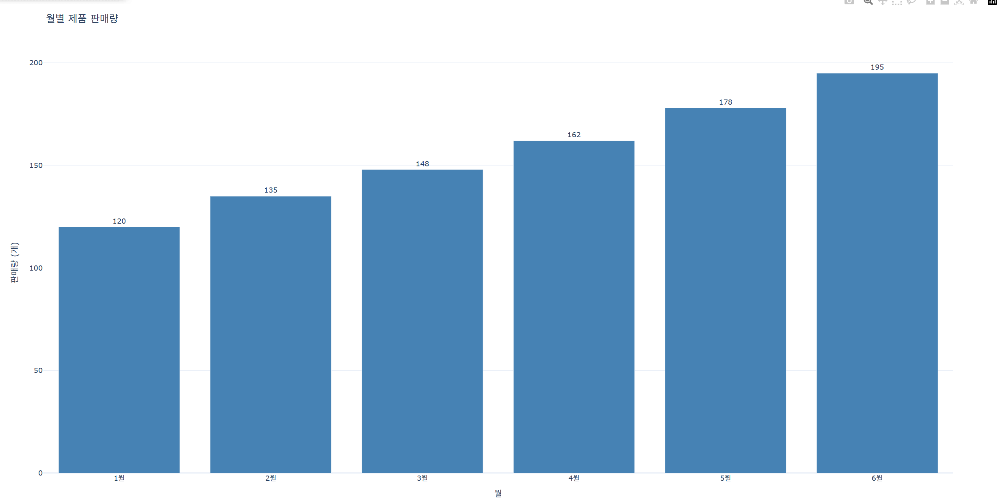
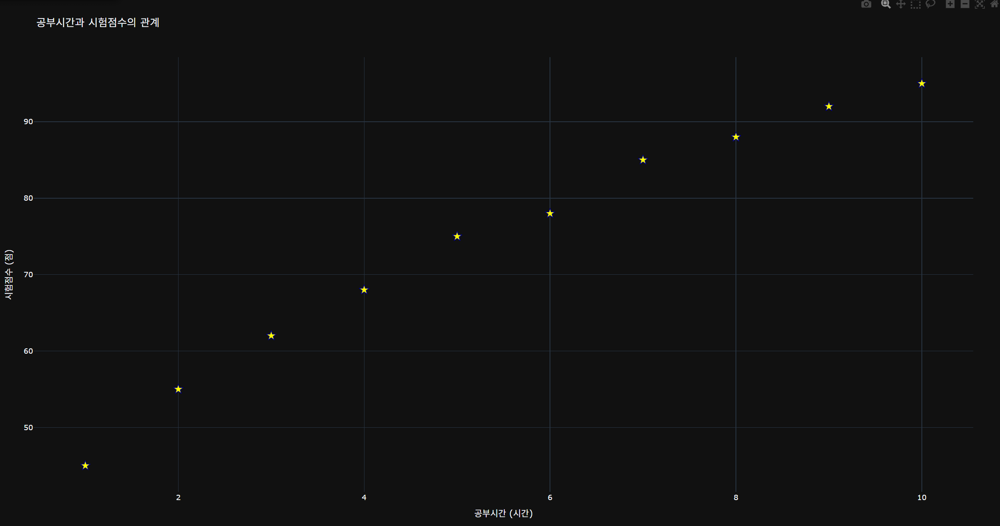
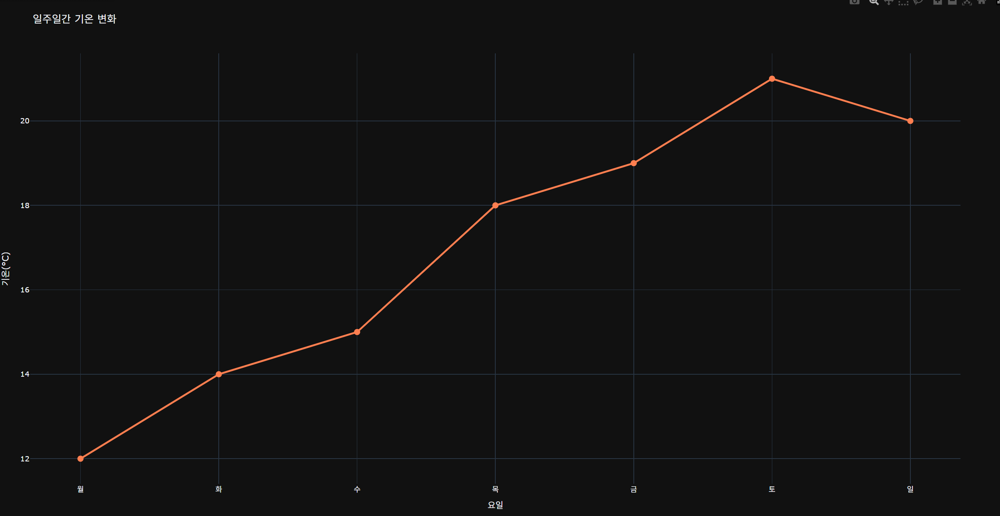
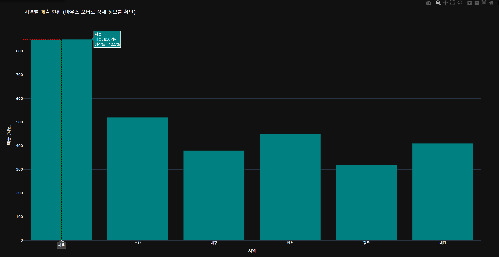
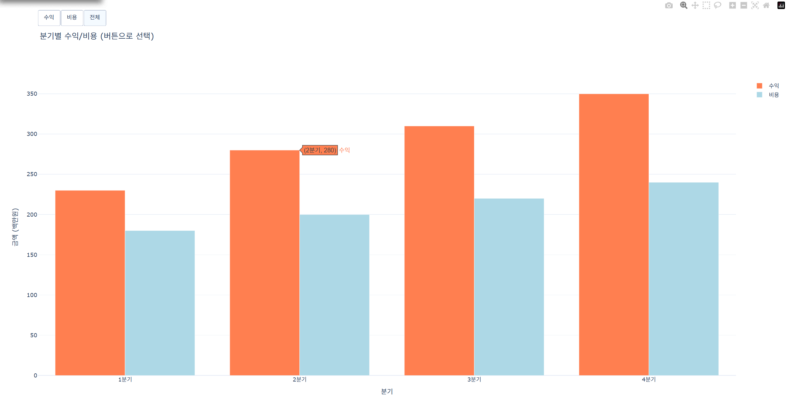
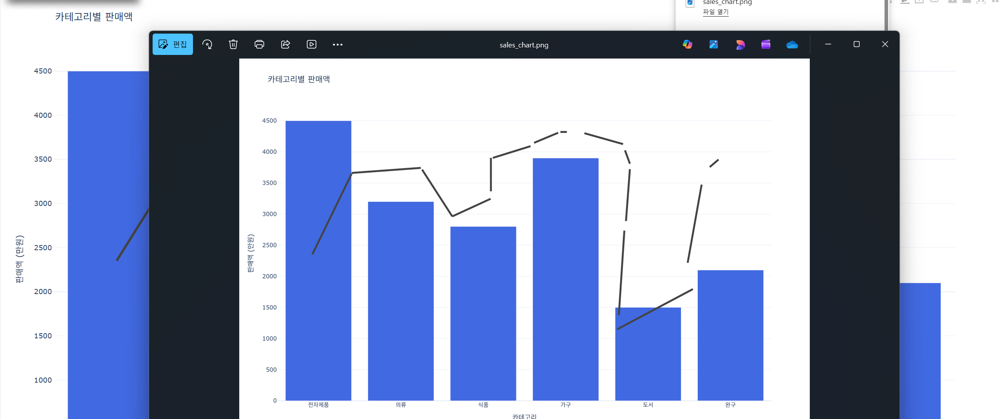
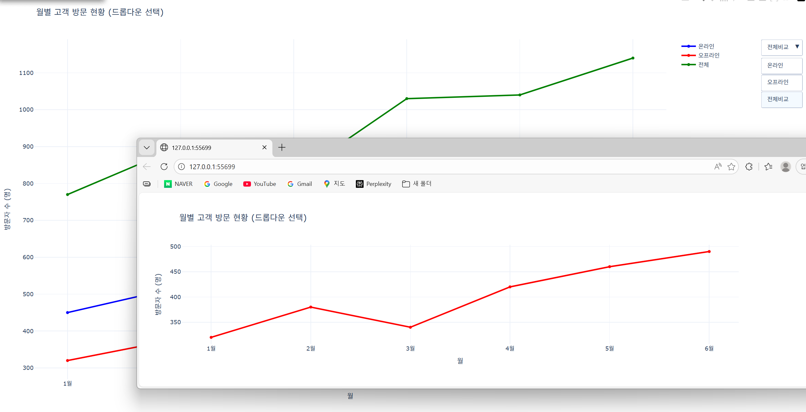
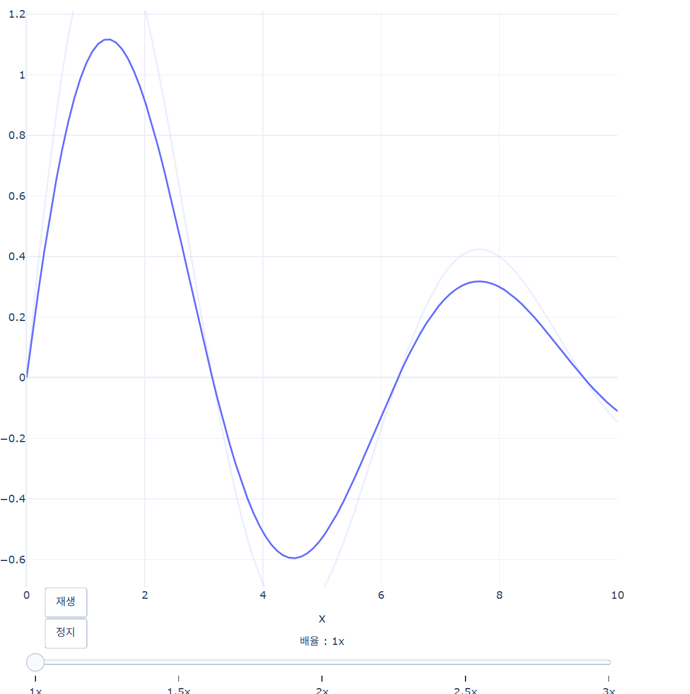
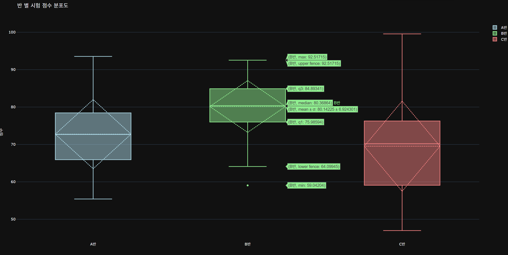
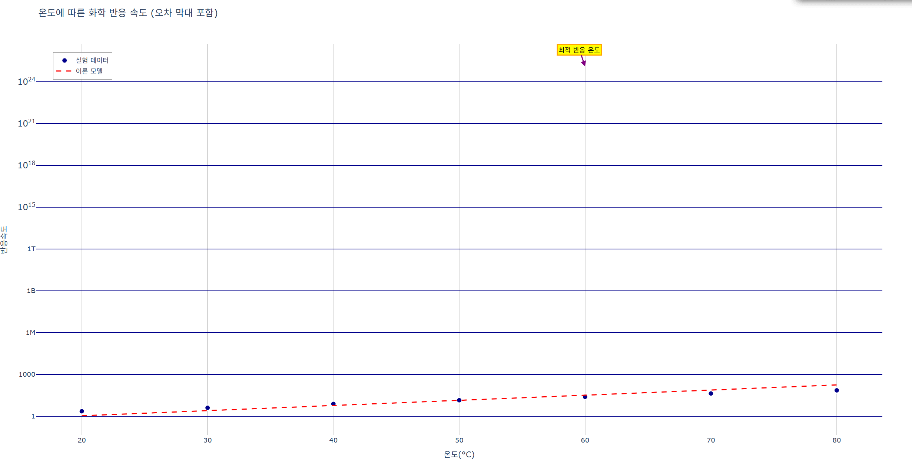

# Plotly Basic Visualization Practice

Plotly Express를 활용한 인터랙티브 데이터 시각화 학습 프로젝트

## 📌 Description

Plotly Express를 활용하여 Scatter Plot과 Histogram을 생성하고, 템플릿, 범례, 축/그리드 설정을 실습한 코드입니다.

## 📊 Dataset

- `plotly.express` 내장 `tips` 데이터셋 사용

## 🎨 Visualizations

### Task 1: 기본 차트
막대 그래프, 산점도, 선 그래프를 구현했습니다.





### Task 2: Hover 정보 커스터마이징
마우스 오버 시 표시되는 정보를 커스터마이징하고 spike line을 추가했습니다.



### Task 3: 버튼 인터랙션
버튼을 통해 수익/비용 데이터를 선택적으로 표시할 수 있습니다.



### Task 4: 모드바 커스터마이징
차트 도구 모음을 커스터마이징했습니다.



### Task 5: 드롭다운 메뉴
드롭다운으로 온라인/오프라인 방문자 데이터를 전환할 수 있습니다.



### Task 6: 슬라이더 & 애니메이션
슬라이더로 배율을 조절하고 애니메이션 재생이 가능합니다.



### Task 7: 통계 차트 (Box Plot)
반별 시험 점수 분포를 박스 플롯으로 시각화했습니다.



### Task 8: 과학 차트 (Error Bars)
온도에 따른 화학 반응 속도를 오차 막대와 함께 표현했습니다.



## 🚀 Installation & Usage

### Requirements
```bash
pip install plotly numpy
```

### Run
```bash
python task_0113_plotly_tips.py
```

## 📚 Key Features

### 기본 차트
- `go.Bar()` - 막대 그래프
- `go.Scatter()` - 산점도 및 선 그래프
- `go.Box()` - 박스 플롯

### 인터랙티브 기능
- **Hover Templates** - 커스텀 정보 표시
- **Buttons** - 데이터 필터링
- **Dropdown** - 메뉴 선택
- **Sliders** - 값 조정
- **Animations** - 재생/정지

### 고급 기능
- Error Bars (오차 막대)
- Spike Lines (커서 라인)
- Annotations (주석)
- Exponential Fitting (지수 함수 피팅)


## 📁 Project Structure


## 💡 What I Learned

- Plotly의 다양한 차트 타입과 인터랙티브 기능
- `updatemenus`를 통한 버튼/드롭다운 구현
- `hovertemplate`로 커스텀 정보 표시
- 슬라이더와 애니메이션 프레임 구성
- 통계 및 과학 데이터 시각화 기법


