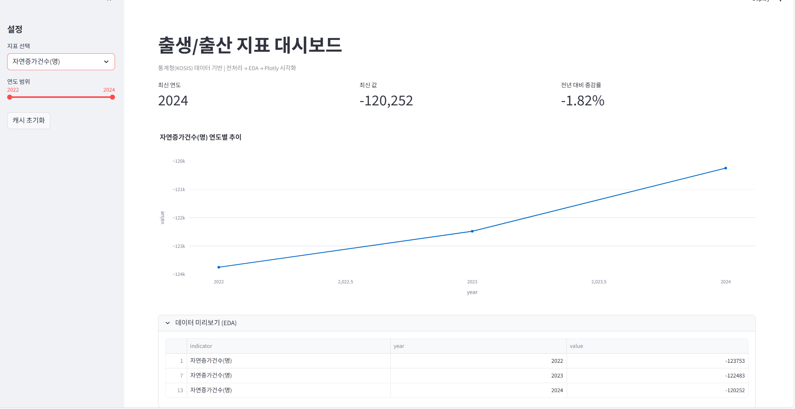
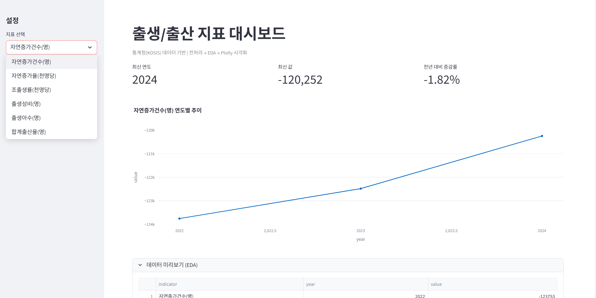

# 📊 출생 · 출산 지표 대시보드 (Streamlit)

통계청(KOSIS) 데이터를 활용하여  
**출생아 수, 합계출산율, 자연증가 등 주요 출생·출산 지표를 연도별로 분석하고 시각화한 Streamlit 대시보드**입니다.

본 프로젝트는 데이터 전처리 → EDA → 시각화 과정을 거쳐  
Streamlit의 **세션 관리와 캐싱 기능**을 함께 학습하는 것을 목표로 합니다.

---

## 🔎 프로젝트 개요

- **주제**: 출생·출산 관련 주요 지표의 연도별 변화 분석
- **데이터 출처**: 통계청(KOSIS)
- **개발 도구**: Streamlit, Pandas, Plotly
- **주요 기능**
  - 지표 선택 드롭다운
  - 연도 범위 필터
  - KPI 요약(최신 연도, 최신 값, 전년 대비 증감률)
  - 연도별 추이 시각화
  - 데이터 미리보기(EDA)

---


## 📑 사용 데이터 설명

- **파일명**  
  `kosis_birth_fertility_natural_change_by_year.csv`

- **포함 지표 예시**
  - 출생아수(명)
  - 합계출산율
  - 자연증가수(명)
  - 자연증가율
  - 조출생률 등

- **데이터 특징**
  - 통계청(KOSIS)에서 제공하는 연도별 확정 통계 데이터
  - 최신 연도 기준 약 **1~2년의 시차**가 존재
  - 일부 지표는 **2년 단위로 제공**되어 연속적인 연도 분석에는 한계가 있음

---

## ⚙️ 주요 구현 기능

### 1️⃣ 데이터 전처리
- 컬럼 수가 많아 **적절한 지표를 선별하는 과정**이 필요했음
- 연도/값 컬럼 타입 정리 및 정렬

### 2️⃣ EDA (탐색적 데이터 분석)
- 선택한 지표에 대한 연도별 데이터 테이블 제공
- 2년 단위 데이터 특성을 고려하여 변화 흐름 위주로 분석

### 3️⃣ 데이터 시각화 (Plotly)
- 연도별 변화 추이를 라인 차트로 시각화
- 마커 표시를 통해 연도별 값 비교 가능

---

## 🧠 세션 & 캐싱 활용

### `st.session_state`
- 사용자가 선택한 **지표 / 연도 범위**를 세션에 저장
- 페이지 리렌더링 시에도 선택 값 유지

### `st.cache_data`
- CSV 로딩 및 전처리 결과 캐싱
- 동일한 입력에 대해 재연산을 방지하여 성능 개선

### `st.cache_resource`
- 세션 객체와 같은 리소스를 캐싱하여 불필요한 재생성 방지

---

## ▶ 실행 방법

1. 필요한 패키지 설치
```bash
pip install streamlit pandas plotly
```

2. 프로젝트 폴더로 이동
```bash
cd population_dashboard
```

3. Streamlit 앱 실행
```bash
streamlit run population_dashboard.py
```

4. 브라우저에서 자동 실행 또는  
`http://localhost:8501` 접속

---

## 🖥 실행 화면 예시

- 메인 대시보드 화면  

- 지표 선택 드롭다운 화면  


---

## ✨ 느낀 점

- 통계청 데이터는 **컬럼과 지표 종류가 매우 다양**하여,  
  프로젝트 목적에 맞는 통계 자료를 선별하는 과정이 가장 어려웠습니다.
- 특히 일부 데이터는 **2년 단위로 제공**되어,  
  연속적인 연도 분석보다는 추세 중심의 해석이 필요했습니다.
- Streamlit을 활용하여 단순 시각화를 넘어  
  **사용자 입력에 따라 동적으로 변화하는 대시보드**를 구현할 수 있었습니다.

