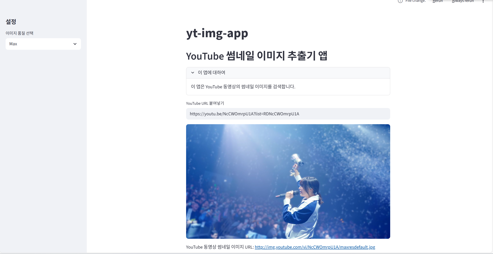

# 🎞️ YouTube 썸네일 이미지 추출 앱 (Streamlit)

본 프로젝트는 Streamlit을 활용하여  
**사용자가 입력한 YouTube URL로부터 동영상 썸네일 이미지를 추출하는 간단한 웹 애플리케이션**입니다.

Streamlit의 기본 컴포넌트 사용과  
사용자 입력 → 처리 → 출력의 전체 흐름을 이해하는 것을 목표로 진행하였습니다.


---

## 🔎 프로젝트 개요

- **주제**: YouTube 동영상 썸네일 이미지 추출
- **학습 목표**
  - Streamlit 기본 입력 컴포넌트 사용
  - URL 문자열 처리 로직 이해
  - 사용자 입력에 따라 동적으로 결과가 변경되는 앱 구조 이해

---

## ⚙️ 주요 기능

- YouTube URL 입력
- URL 문자열 처리를 통한 video id 추출
- 썸네일 이미지 해상도 선택
- 선택한 해상도의 썸네일 이미지 출력
- 썸네일 이미지 URL 표시

---

## 🧩 구현 설명

### 1️⃣ 사용자 입력 처리
- `st.text_input`을 사용하여 YouTube URL을 입력받음
- 기본 URL 형식을 제공하여 사용자의 입력을 유도

### 2️⃣ URL 문자열 처리
- `youtu.be` 형식과 `youtube.com` 형식 URL을 구분
- 문자열 분리를 통해 video id 추출

### 3️⃣ 썸네일 이미지 출력
- 선택한 해상도에 따라 썸네일 이미지 URL 생성
- `st.image`를 사용하여 이미지 출력
- 생성된 이미지 URL을 함께 표시

---

## ▶ 실행 방법

1. 필요한 패키지 설치
```bash
pip install streamlit
```

2. 앱 실행
```bash
streamlit run yt-img-app.py
```

3. 브라우저에서 자동 실행 또는  
`http://localhost:8501` 접속

---

## ✨ 느낀 점

- 사용자 입력 → 처리 → 출력이라는  
  웹 애플리케이션의 기본 흐름을 이해하는 데 도움이 되었다.
- Streamlit의 기본 컴포넌트만으로도  
  빠르게 인터랙티브한 앱을 만들 수 있다는 점이 인상적이었다.

---
