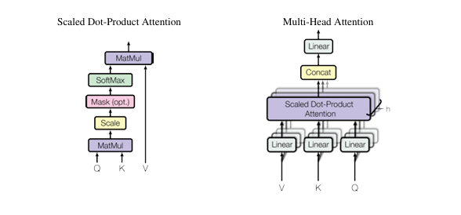

# Attention Is All You Need

저자 : Ashish Vaswani 외 7명

학회 : 31st Conference on Neural Information Processing Systems (NIPS 2017), Long Beach, CA, USA

https://arxiv.org/pdf/1706.03762

Abstract 원문 
--

The dominant sequence transduction models are based on complex recurrent or
convolutional neural networks that include an encoder and a decoder. The best
performing models also connect the encoder and decoder through an attention
mechanism. We propose    a new simple network architecture, the Transformer,
based solely on attention mechanisms, dispensing with recurrence and convolutions
entirely. Experiments on two machine translation tasks show these models to
be superior in quality while being more parallelizable and requiring significantly
less time to train. Our model achieves 28.4 BLEU on the WMT 2014 English
to-German translation task, improving over the existing best results, including
ensembles, by over 2 BLEU. On the WMT 2014 English-to-French translation task,
our model establishes a new single-model state-of-the-art BLEU score of 41.8 after
training for 3.5 days on eight GPUs, a small fraction of the training costs of the
best models from the literature. We show that the Transformer generalizes well to
other tasks by applying it successfully to English constituency parsing both with
large and limited training data

## 🎯 목적 

기존의 대표적인 시퀀스 변환 모델들은 인코더와 디코더를 포함한 순환신경망(RNN)또는 합성곱 신경망 (CNN) 기반 구조해 의존 해옴. 

성능이 가장 좋은 모델들은 보통 어텐션 메커니즘을 통해 인코더와 디코더를 연결한다.

본 논문에서는 순환구조 RNN 나 합성곱 RNN 을 완전히 제거하고, 오직 어텐션 매커니즘만을 기반으로 하는 새로운 단순한 네트워크 구조인 transfomer 를 제안한다. 

## 🧪 실험 

2가지 기계 번역 작업 실헙 결과 (machine translation)
- 우수 성능을 보이고, 병렬 처리에 유리하며, 학습 시간을 크게 줄일 수 있었다. 
- 기존의 최고 성능 모델(앙상블 모델 포함) 들 보다 BLEU 가 향상된 것을 확인 할 수 있었다.

영어 > 독일어

영어 > 불어

적은 학습 으로 얻은 결과 설명.

## 실험 결과 
순환구조 RNN 나 합성곱 RNN 을 완전히 제거 후 어텐션 메커니즘 기반으로만 만든 트랜스포머 가 
좋은 성능을 내었다 .

(..중략 세팅 관련 내용 생략)

## Model Architecture

# Encoder / Decoder

Transformer는 Encoder와 Decoder 구조로 이루어져 있다.

각 Encoder layer는 다음 두 가지로 구성된다.

Multi-Head Self-Attention

Feed Forward Network

Decoder는 Encoder와 유사한 구조를 가지지만,
Encoder의 출력에 대한 Attention과
미래 토큰을 보지 못하도록 하는 Masking을 추가로 사용한다.

# Attention
Attention은 Query, Key, Value로 구성된다.

Q와 K의 유사도를 계산하여
Query와 Key의 유사도를 계산하여 softmax를 통해 가중치를 생성하고,
이 가중치를 이용해 **Value의 가중합(weighted sum)**을 계산하여 출력한다.

### Multi-Head Attention
여러 Attention을 병렬로 수행하여
문장 내 다양한 관계를 동시에 학습한다.

## Why Self-Attention
Self-Attention 레이어를 기존에 널리 사용되던
순환 신경망(RNN)과 합성곱 신경망(CNN) 레이어와 비교한다.

보통 가변 길이의 입력 시퀀스
(x1, x2, ... , xn) 

을 동일한 길이의 출력 시퀀스
(z1, z2, ... , zn)

으로 변환하는 데 사용한다.
xi 와 zi 는 ℝᵈ 공간의 벡터이다.

이러한 구조는 일반적인 시퀀스 변환 모델(sequence transduction model) 의
인코더나 디코더의 은닉층(hidden layer) 에서 사용된다.

### Self-Attention을 사용하는 이유
다음 세 가지 기준을 고려한다.

- Computational Complexity
→ 레이어 당 계산 복잡도

- Parallelization
→ 병렬 처리 가능성

- Long-range Dependency
→ 멀리 떨어진 단어 간 관계 학습 능력

Self-Attention은 병렬 처리가 가능하고
계산 효율성이 높으며
장거리 의존성(long-range dependency)을 더 쉽게 학습할 수 있다.

### 계산 효율성 비교

Self-Attention 레이어는 모든 위치를
상수 개수의 순차 연산으로 연결할 수 있다.

반면 RNN 레이어는
시퀀스 길이에 따라 O(n) 개의 순차 연산이 필요하다.

따라서 Self-Attention은 RNN보다
병렬 처리에 더 유리하다.

### Long-range Dependency

많은 자연어 처리 문제에서는
멀리 떨어진 단어들 사이의 관계를 학습하는 것이 중요하다.

Self-Attention은 모든 토큰이 서로 직접 연결되기 때문에
이러한 장거리 의존성(long-range dependency) 을
더 쉽게 학습할 수 있다.

### CNN과 비교

CNN 구조에서는 모든 입력과 출력 위치를 연결하기 위해
여러 개의 convolution layer가 필요하다.

이 경우 두 위치 사이의 경로 길이(path length) 가 길어지게 된다.

반면 Self-Attention은
모든 토큰을 한 번의 연산으로 직접 연결할 수 있어
경로 길이가 더 짧다.

### 추가 장점

Self-Attention은 모델의 동작을
해석하기 쉬운(interpretable) 특징도 가진다.

논문에서는 attention 분포를 분석한 결과
각 attention head가 서로 다른 역할을 학습하며
문장의 문법적 구조와 의미적 관계를 포착하는 모습을 보였다.

--

Section 5 (Training)는 모델의 학습 과정(training setup) 을 설명하는 부분으로
데이터셋 구성, optimizer, learning rate schedule 등
구현 및 실험 설정에 대한 세부 사항을 다룬다.
본 정리에서는 모델 구조와 핵심 개념 이해에 집중하기 위해 생략하였다.

## Results (실험 결과)

Transformer의 성능을 기계 번역 실험을 통해 평가하였다.

**실험**

- 영어 → 독일어 번역 (EN → DE)
- 영어 → 프랑스어 번역 (EN → FR)

**데이터셋**

- WMT 2014

**결과**

- BLEU 28.4 (EN → DE)
- BLEU 41.8 (EN → FR)

**요약**

Transformer는 기존 최고 모델보다 높은 성능을 보였으며  
더 적은 학습 비용으로 **state-of-the-art (SOTA, 최고 성능)** 를 달성하였다.

## Conclusion 요약

- Transformer는 기존 RNN/CNN 기반 모델과 달리  
  Self-Attention만으로 구성된 sequence transduction 모델이다.

- 기계 번역 실험에서 기존 모델보다 빠른 학습과  
  더 높은 성능을 달성하며 새로운 state-of-the-art를 기록하였다.

- 또한 Attention 기반 모델이 다양한 분야로  
  확장될 가능성을 보여주었다.

## Reference
Vaswani et al., "Attention Is All You Need", NeurIPS 2017  
https://arxiv.org/abs/1706.03762

