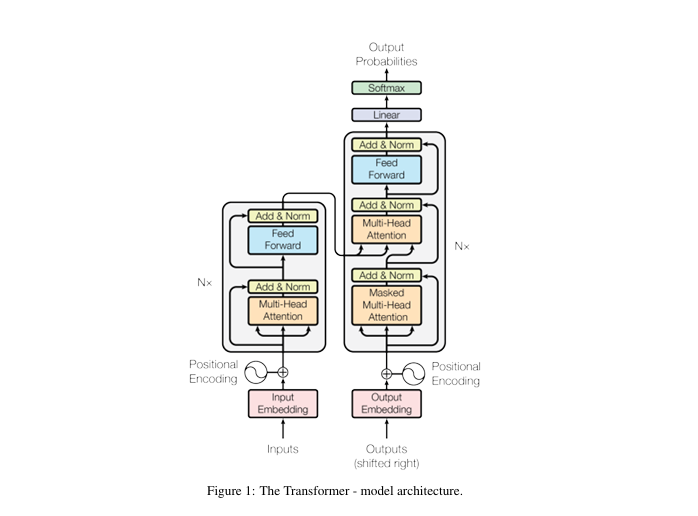

# Attention Is All You Need

저자 : Ashish Vaswani 외 7명

학회 : 31st Conference on Neural Information Processing Systems (NIPS 2017), Long Beach, CA, USA

https://arxiv.org/pdf/1706.03762

Abstract 원문 
--

The dominant sequence transduction models are based on complex recurrent or
convolutional neural networks that include an encoder and a decoder. The best
performing models also connect the encoder and decoder through an attention
mechanism. We propose    a new simple network architecture, the Transformer,
based solely on attention mechanisms, dispensing with recurrence and convolutions
entirely. Experiments on two machine translation tasks show these models to
be superior in quality while being more parallelizable and requiring significantly
less time to train. Our model achieves 28.4 BLEU on the WMT 2014 English
to-German translation task, improving over the existing best results, including
ensembles, by over 2 BLEU. On the WMT 2014 English-to-French translation task,
our model establishes a new single-model state-of-the-art BLEU score of 41.8 after
training for 3.5 days on eight GPUs, a small fraction of the training costs of the
best models from the literature. We show that the Transformer generalizes well to
other tasks by applying it successfully to English constituency parsing both with
large and limited training data

정리 : 

## 🎯 목적 

기존의 대표적인 시퀀스 변환 모델들은 인코더와 디코더를 포함한 순환신경망(RNN)또는 합성곱 신경망 (CNN) 기반 구조해 의존 해옴. 

성능이 가장 좋은 모델들은 보통 어텐션 메커니즘을 통해 인코더와 디코더를 연결한다.

본 논문에서는 순환구조 RNN 나 합성곱 RNN 을 완전히 제거하고, 오직 어텐션 매커니즘만을 기반으로 하는 새로운 단순한 네트워크 구조인 transfomer 를 제안한다. 

## 🧪 실험 

2가지 기계 번역 작업 실헙 결과 (machine translation)
- 우수 성능을 보이고, 병렬 처리에 유리하며, 학습 시간을 크게 줄일 수 있었다. 
- 기존의 최고 성능 모델(앙상블 모델 포함) 들 보다 BLEU 가 향상된 것을 확인 할 수 있었다.

영어 > 독일어

영어 > 불어

적은 학습 으로 얻은 결과 설명.

## ⭐ 핵심
순환구조 RNN 나 합성곱 RNN 을 완전히 제거 후 어텐션 메커니즘 기반으로만 만든 트랜스포머 가 
좋은 성능을 내었다 .

(..중략 세팅 관련 내용 생략)

## Model Architecture

