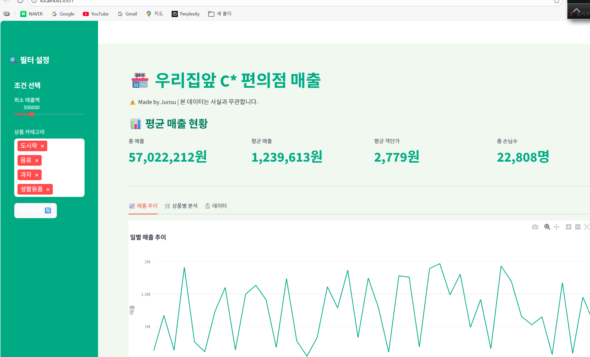
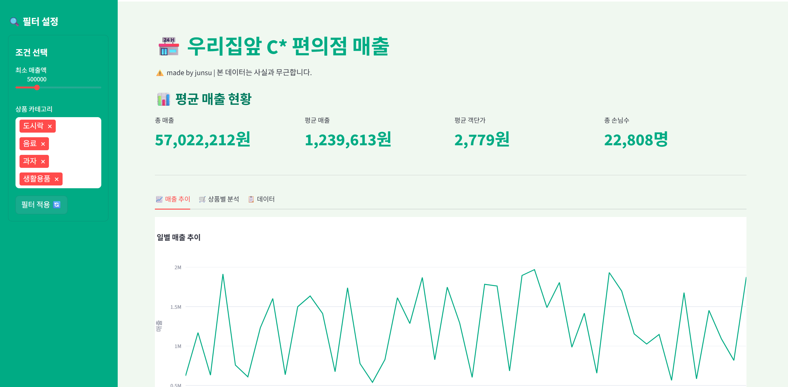
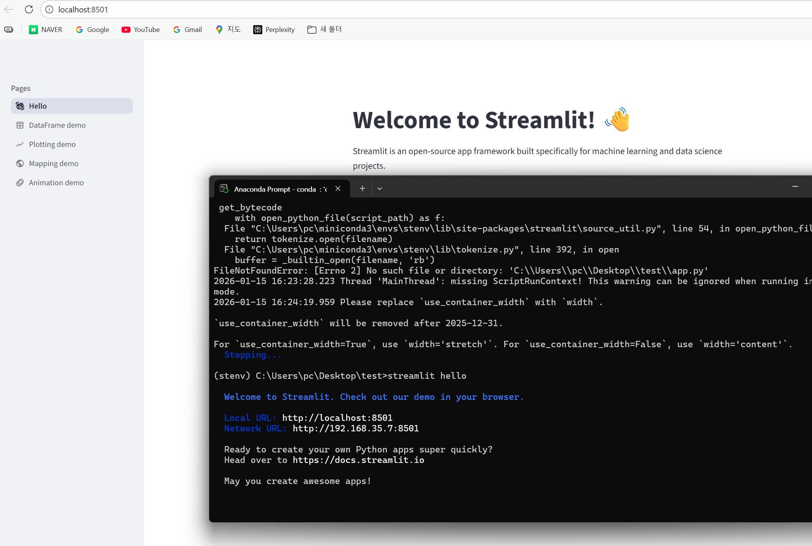
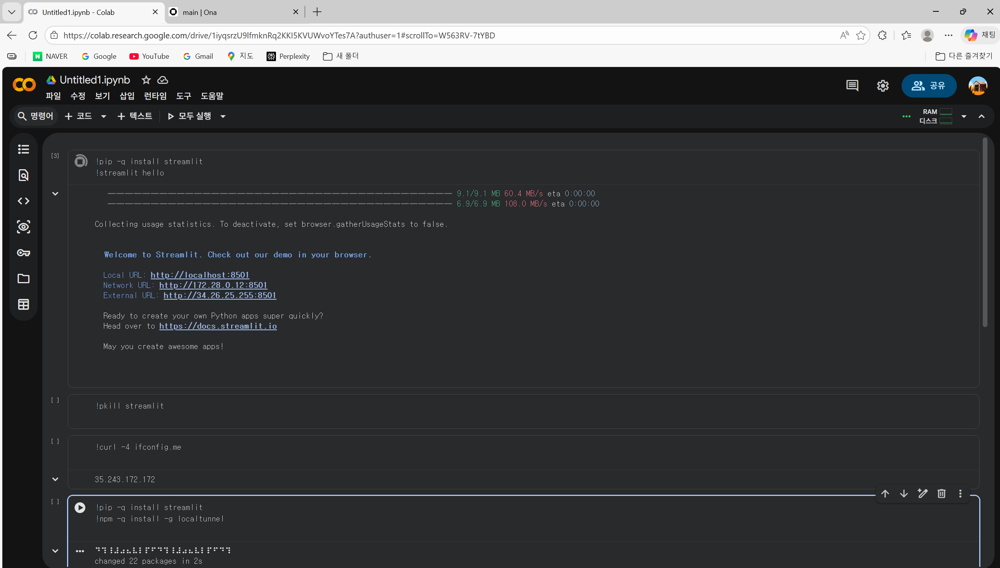

# Streamlit 토이 프로젝트 – 편의점 매출 대시보드

---

## 1. 프로젝트 개요

본 프로젝트는 **Streamlit 기본 컴포넌트와 레이아웃 구조를 이해하기 위한 토이 프로젝트**입니다.  
편의점 매출 데이터를 가정하여, 필터와 시각화를 통해 매출 현황을 한눈에 확인할 수 있는 **대시보드 형태의 웹 앱**을 구현했습니다.

- 프로젝트 주제: **우리집앞 C\* 편의점 매출 대시보드**
- 사용 기술: **Python, Streamlit, Plotly**
- 실행 환경: **Local / Google Colab / Gitpod**

---

## 2. 프로젝트 목표

- Streamlit 기본 레이아웃 구조 이해
- 입력 컴포넌트(slider, multiselect 등) 활용
- Plotly 기반 데이터 시각화 연동
- Local / Colab / Gitpod 환경에서 Streamlit 실행 경험

---

## 3. 메인 대시보드 화면



---

## 4. 주요 기능

### 4.1 사이드바 필터 UI

- 최소 매출액 슬라이더
- 상품 카테고리 멀티 선택
- 필터 적용 버튼

사용 컴포넌트:
- `st.sidebar`
- `st.slider`
- `st.multiselect`
- `st.button`

---

### 4.2 핵심 지표(Metric)

- 총 매출
- 평균 매출
- 평균 객단가
- 총 손님 수

사용 컴포넌트:
- `st.metric`
- `st.columns`

---

### 4.3 매출 추이 시각화

일별 매출 추이를 **Plotly 선 그래프**로 시각화했습니다.

사용 컴포넌트:
- `st.plotly_chart`



---

## 5. Streamlit 기본 실행 확인

과제 요구사항에 따라 **Streamlit 기본 환영 화면(hello)** 을 각 환경에서 확인했습니다.

### 5.1 Local 환경

```bash
streamlit hello
```



---

### 5.2 Google Colab 환경

```bash
!pip install streamlit
!streamlit hello
```



---

### 5.3 Gitpod 환경

- Gitpod 기반 VS Code 환경에서 실행
- 터미널에서 `streamlit run app.py` 실행
- External URL을 통해 정상 동작 확인

```bash
streamlit run app.py
```

---
### Streamlit과 Gradio 비교

이번 과제를 통해 Streamlit을 처음 사용하면서, Gradio와의 차이점을 조사해보게 되었습니다.

**Gradio**는 머신러닝 모델 데모에 특화된 도구입니다. 입력값을 넣고 바로 결과를 확인하는 단순한 인터페이스 구성에 강점이 있어, 모델 중심의 입출력 UI를 빠르게 만들 때 적합합니다.

**Streamlit**은 데이터 기반 화면 구성과 대시보드 제작에 더 적합합니다. 사이드바, 컬럼, 탭, 지표 카드 등 다양한 레이아웃 컴포넌트를 제공해 여러 정보를 한 화면에 정리하기 쉽습니다. 이번 프로젝트에서 필터 → 지표 → 그래프 흐름을 자연스럽게 구성할 수 있었습니다.

아직 Gradio를 직접 사용해보진 않았지만, **Gradio는 모델 데모용, Streamlit은 데이터 대시보드용**으로 목적이 비교적 명확하게 구분된다는 점을 이해할 수 있었습니다.


---

## . 프로젝트 정리

- Streamlit 기본 컴포넌트를 활용한 대시보드 형태의 토이 프로젝트를 완성했습니다.
- Local / Colab / Gitpod 환경에서 Streamlit 실행을 모두 경험했습니다.
- 데이터 시각화와 사용자 입력 기반 UI 흐름을 이해할 수 있었습니다.

> ⚠️ 본 프로젝트의 데이터는 실습용 가상 데이터이며 실제 매출과 무관합니다!

